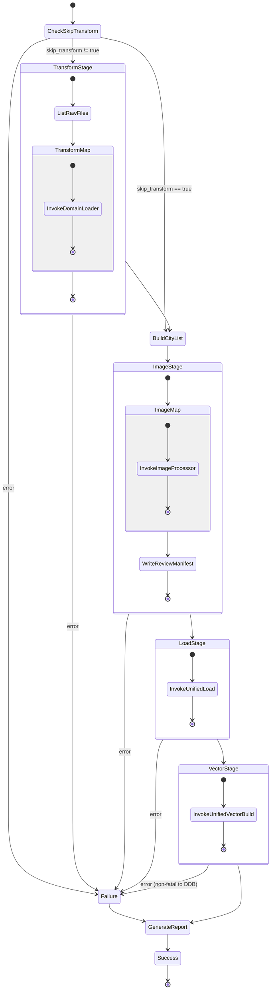
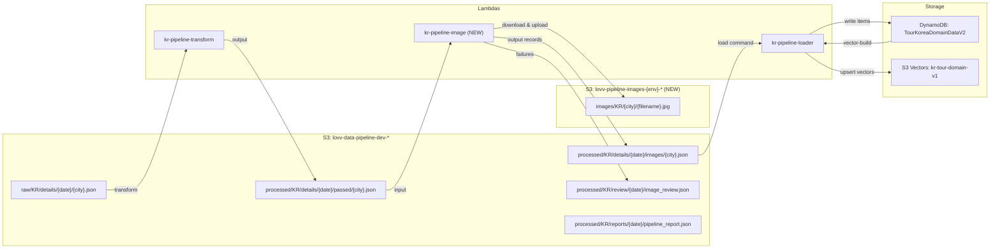

# Design Document: kr-data-pipeline

## Overview

이 설계는 AWS Step Functions 상태 머신을 사용하여 전국 211개 도시의 관광 데이터를 End-to-End로 처리하는 자동 파이프라인을 구현한다. 기존 Lambda 3개(`kr-pipeline-transform`, `kr-pipeline-loader`, `kr-pipeline-vector`)를 재사용하고, 신규 Lambda 1개(`kr-pipeline-image`)만 추가하여 이미지 처리를 담당한다.

**핵심 설계 결정:**
- Step Functions Map State로 도시 단위 병렬 처리 → Lambda 15분 타임아웃 제약 해결
- 기존 Lambda를 ARN으로 호출하여 코드 중복 제거
- `kr-pipeline-image`는 `kr_image_uploader` 모듈을 재사용하여 이미지 다운로드/업로드 로직 공유
- Lambda Layer로 `requests` 라이브러리 제공 (외부 CDN 이미지 다운로드용)

## Architecture

### Step Functions 상태 머신 흐름



### 데이터 흐름 다이어그램



## Components and Interfaces

### 1. Step Functions State Machine (`kr-data-pipeline-{env}`)

**실행 입력 스키마:**
```json
{
  "bucket": "lovv-data-pipeline-dev-925273580929",
  "ingest_date": "20260625",
  "table_name": "TourKoreaDomainDataV2",
  "skip_transform": false,
  "province_id": null
}
```

**ASL 구조 (핵심):**
```json
{
  "Comment": "KR Data Pipeline - E2E orchestration",
  "StartAt": "CheckSkipTransform",
  "States": {
    "CheckSkipTransform": {
      "Type": "Choice",
      "Choices": [
        {
          "Variable": "$.skip_transform",
          "BooleanEquals": true,
          "Next": "BuildCityList"
        }
      ],
      "Default": "TransformStage"
    },
    "TransformStage": {
      "Type": "Map",
      "ItemsPath": "$.city_files",
      "MaxConcurrency": 10,
      "Iterator": {
        "StartAt": "InvokeDomainLoader",
        "States": {
          "InvokeDomainLoader": {
            "Type": "Task",
            "Resource": "arn:aws:lambda:{region}:{account}:function:kr-pipeline-transform",
            "End": true,
            "Retry": [{"ErrorEquals": ["States.TaskFailed"], "MaxAttempts": 2, "BackoffRate": 2}]
          }
        }
      },
      "ResultPath": "$.transform_results",
      "Next": "BuildCityList",
      "Catch": [{"ErrorEquals": ["States.ALL"], "Next": "HandleFailure"}]
    },
    "BuildCityList": {
      "Type": "Pass",
      "Next": "ImageStage",
      "Comment": "S3 ListObjects로 processed/{date}/passed/ 아래 파일 목록 구성"
    },
    "ImageStage": {
      "Type": "Map",
      "ItemsPath": "$.city_list",
      "MaxConcurrency": 10,
      "Iterator": {
        "StartAt": "InvokeImageProcessor",
        "States": {
          "InvokeImageProcessor": {
            "Type": "Task",
            "Resource": "arn:aws:lambda:{region}:{account}:function:kr-pipeline-image",
            "End": true,
            "Retry": [{"ErrorEquals": ["States.TaskFailed"], "MaxAttempts": 1, "BackoffRate": 2}]
          }
        }
      },
      "ResultPath": "$.image_results",
      "Next": "AggregateReviewManifest",
      "Catch": [{"ErrorEquals": ["States.ALL"], "Next": "HandleFailure"}]
    },
    "AggregateReviewManifest": {
      "Type": "Task",
      "Resource": "arn:aws:lambda:{region}:{account}:function:kr-pipeline-image",
      "Parameters": {
        "command": "aggregate_review",
        "bucket.$": "$.bucket",
        "ingest_date.$": "$.ingest_date",
        "image_results.$": "$.image_results"
      },
      "ResultPath": "$.review_manifest",
      "Next": "LoadStage"
    },
    "LoadStage": {
      "Type": "Task",
      "Resource": "arn:aws:lambda:{region}:{account}:function:kr-pipeline-loader",
      "Parameters": {
        "command": "load",
        "bucket.$": "$.bucket",
        "prefix.$": "States.Format('processed/KR/details/{}/images/', $.ingest_date)",
        "table_name.$": "$.table_name"
      },
      "ResultPath": "$.load_results",
      "Next": "VectorStage",
      "Retry": [{"ErrorEquals": ["States.TaskFailed"], "MaxAttempts": 2, "BackoffRate": 2}],
      "Catch": [{"ErrorEquals": ["States.ALL"], "Next": "HandleFailure"}]
    },
    "VectorStage": {
      "Type": "Task",
      "Resource": "arn:aws:lambda:{region}:{account}:function:kr-pipeline-loader",
      "Parameters": {
        "command": "vector-build",
        "table_name.$": "$.table_name",
        "rebuild_mode": "full"
      },
      "ResultPath": "$.vector_results",
      "Next": "GenerateReport",
      "Retry": [{"ErrorEquals": ["States.TaskFailed"], "MaxAttempts": 1, "BackoffRate": 2}],
      "Catch": [{"ErrorEquals": ["States.ALL"], "Next": "GenerateReport"}]
    },
    "GenerateReport": {
      "Type": "Task",
      "Resource": "arn:aws:lambda:{region}:{account}:function:kr-pipeline-image",
      "Parameters": {
        "command": "generate_report",
        "bucket.$": "$.bucket",
        "ingest_date.$": "$.ingest_date",
        "execution_context.$": "$"
      },
      "ResultPath": "$.report",
      "Next": "Success"
    },
    "HandleFailure": {
      "Type": "Pass",
      "Next": "GenerateReport",
      "ResultPath": "$.failure_info"
    },
    "Success": {
      "Type": "Succeed"
    }
  }
}
```

### 2. kr-pipeline-image Lambda (신규)

**Handler 인터페이스:**

```python
# src/kr_image_processor/handlers/image_handler.py

def handler(event: dict[str, Any], context: Any) -> dict[str, Any]:
    """Multi-command Lambda handler.
    
    Commands:
      - "process_city" (default): 도시 단위 이미지 다운로드 + S3 업로드
      - "aggregate_review": 모든 도시의 리뷰 레코드를 단일 manifest로 병합
      - "generate_report": 실행 보고서 생성
    """
```

**process_city 입력:**
```json
{
  "command": "process_city",
  "bucket": "lovv-data-pipeline-dev-925273580929",
  "ingest_date": "20260625",
  "city_name_en": "Seoul",
  "source_key": "processed/KR/details/20260625/passed/Seoul.json"
}
```

**process_city 출력:**
```json
{
  "statusCode": 200,
  "city_name_en": "Seoul",
  "output_key": "processed/KR/details/20260625/images/Seoul.json",
  "summary": {
    "total_records": 45,
    "images_downloaded": 38,
    "images_failed": 3,
    "no_source_image": 4,
    "review_count": 7
  },
  "review_entries": [
    {
      "city_name_en": "Seoul",
      "content_id": "12345",
      "entity_type": "attraction",
      "original_image_url": "http://...",
      "failure_reason": "download_failed",
      "error_message": "HTTPError: 404",
      "timestamp": "2026-06-25T10:30:00Z"
    }
  ]
}
```

**핵심 모듈 구성:**

```
src/kr_image_processor/
├── __init__.py
├── handlers/
│   └── image_handler.py      # Lambda entry point (multi-command)
├── processor.py               # 도시 단위 이미지 처리 로직
├── review.py                  # 리뷰 매니페스트 생성
├── report.py                  # 실행 보고서 생성
└── tests/
    ├── __init__.py
    ├── test_processor.py
    ├── test_review.py
    └── test_properties.py     # Property-based tests
```

### 3. 기존 Lambda 인터페이스 (변경 없음 / 최소 변경)

**kr-pipeline-transform** (기존 그대로):
```json
// 입력
{"bucket": "...", "raw_key": "raw/KR/details/20260625/Seoul.json"}
// 출력
{"statusCode": 200, "summary": {...}}
```

**kr-pipeline-loader `load` 명령** (prefix 파라미터 추가):
```json
// 입력
{"command": "load", "bucket": "...", "prefix": "processed/KR/details/20260625/images/", "table_name": "TourKoreaDomainDataV2"}
// 출력
{"statusCode": 200, "loaded": 1500, "failed": 3}
```

**kr-pipeline-loader `vector-build` 명령** (기존 그대로):
```json
// 입력
{"command": "vector-build", "table_name": "TourKoreaDomainDataV2", "rebuild_mode": "full"}
// 출력
{"statusCode": 200, "manifest": {"processed": 1500, "upserted": 1500, "skipped": 0, "errors": 0}}
```

### 4. Lambda Layer (requests)

**구성:**
```
layers/requests/
├── build.sh                  # pip install -t python/ && zip
└── python/
    ├── requests/
    ├── urllib3/
    ├── certifi/
    ├── charset_normalizer/
    └── idna/
```

**빌드 스크립트:**
```bash
#!/bin/bash
# layers/requests/build.sh
set -e
rm -rf python/ layer.zip
pip install requests -t python/ --platform manylinux2014_x86_64 --only-binary=:all: --python-version 3.12
zip -r layer.zip python/
echo "Layer size: $(du -sh layer.zip | cut -f1)"
```

## Data Models

### Image-Processed Record (Image_Stage 출력)

기존 `transform_content_record` 출력에 이미지 관련 필드가 추가/변경된 형태:

```python
{
    # ... 기존 필드 모두 유지 ...
    "image_url": "https://lovv-data-pipeline-dev-925273580929.s3.amazonaws.com/images/KR/Seoul/Gyeongbokgung_1.jpg",
    "image_status": "ok",         # "ok" | "needs_review"
    "image_s3_key": "images/KR/Seoul/Gyeongbokgung_1.jpg",  # 내부 참조용
}
```

### Review Manifest Entry

```python
@dataclass
class ReviewEntry:
    city_name_en: str          # "Seoul"
    content_id: str            # "12345"
    entity_type: str           # "attraction" | "festival"
    original_image_url: str    # 원본 URL (빈 문자열 가능)
    failure_reason: str        # "no_source_image" | "download_failed"
    error_message: str         # 에러 상세 (download_failed 시)
    timestamp: str             # ISO 8601
```

### Pipeline Execution Report

```python
{
    "execution_id": "arn:aws:states:...:execution:...",
    "ingest_date": "20260625",
    "status": "success" | "partial" | "failed",
    "started_at": "2026-06-25T10:00:00Z",
    "completed_at": "2026-06-25T10:45:00Z",
    "total_execution_time_seconds": 2700,
    "summary": {
        "total_cities": 211,
        "images_downloaded": 3500,
        "images_failed": 120,
        "review_count": 250,
        "records_loaded": 4200,
        "vectors_built": 4200
    },
    "per_city": [
        {
            "city_name_en": "Seoul",
            "images_ok": 38,
            "images_failed": 3,
            "records_loaded": 45
        }
    ],
    "failure_info": null  # 실패 시: {"stage": "...", "error": "...", "items_before_failure": N}
}
```

### S3 경로 규약

| Stage | Input Path | Output Path |
|-------|-----------|-------------|
| Transform | `raw/KR/details/{date}/{city}.json` | `processed/KR/details/{date}/passed/{city}.json` |
| Image | `processed/KR/details/{date}/passed/{city}.json` | `processed/KR/details/{date}/images/{city}.json` |
| Image (S3 uploads) | — | `images/KR/{city}/{filename}.jpg` (Image_Bucket: `lovv-pipeline-images-{env}-*`) |
| Review | — | `processed/KR/review/{date}/image_review.json` |
| Load | `processed/KR/details/{date}/images/` (prefix) | DynamoDB |
| Vector | DynamoDB | S3 Vectors |
| Report | — | `processed/KR/reports/{date}/pipeline_report.json` |

## Correctness Properties

*A property is a characteristic or behavior that should hold true across all valid executions of a system — essentially, a formal statement about what the system should do. Properties serve as the bridge between human-readable specifications and machine-verifiable correctness guarantees.*

The following properties focus on the new `kr-pipeline-image` Lambda logic, which is the primary new code in this feature.

### Property 1: Image URL Replacement

*For any* city payload containing records with non-empty image URLs that download successfully, the output record's `image_url` field SHALL be a valid S3 URL matching the pattern `https://{bucket}.s3.amazonaws.com/images/KR/{city}/{filename}` and the original external URL SHALL NOT appear in the output.

**Validates: Requirements 2.4**

### Property 2: Failed Downloads Marked for Review

*For any* city payload where image downloads fail (mocked), the corresponding records SHALL have `image_status` set to `"needs_review"` and SHALL appear in the review entries with `failure_reason: "download_failed"`, while all other records in the same batch continue processing normally.

**Validates: Requirements 2.5, 3.2**

### Property 3: Empty Image URL Classification

*For any* record where `image_url` is null, empty string, or whitespace-only, the record SHALL be classified with `failure_reason: "no_source_image"` in the review entries and `image_status: "needs_review"` in the output.

**Validates: Requirements 3.1**

### Property 4: Review Manifest Entry Completeness

*For any* record that enters the review manifest (either no_source_image or download_failed), the resulting entry SHALL contain all required fields: `city_name_en`, `content_id`, `entity_type`, `original_image_url`, `failure_reason`, and `timestamp`.

**Validates: Requirements 3.4**

### Property 5: Output Key Path Correctness

*For any* valid `city_name_en` (ASCII alphanumeric + underscore) and `ingest_date` (YYYYMMDD format), the output S3 key SHALL match the pattern `processed/KR/details/{ingest_date}/images/{city_name_en}.json`.

**Validates: Requirements 2.8**

### Property 6: Execution Report Field Completeness

*For any* combination of per-city image processing results (varying counts of success/failure/review), the generated execution report SHALL contain all required summary fields (`total_cities`, `images_downloaded`, `images_failed`, `review_count`, `records_loaded`, `vectors_built`, `total_execution_time_seconds`) and each city SHALL appear in the `per_city` breakdown.

**Validates: Requirements 8.2, 8.3**

### Property 7: Record Count Invariant

*For any* city payload with N records, the sum of (successfully processed records + review records) SHALL equal N. No records shall be lost or duplicated during image processing.

**Validates: Requirements 2.3, 3.1**

## Error Handling

### Retry Strategy

| Component | Error Type | Retry | Backoff | Fallback |
|-----------|-----------|-------|---------|----------|
| kr-pipeline-transform | Lambda timeout/failure | 2 attempts | 2x | Fail stage |
| kr-pipeline-image | Image download 4xx/5xx | 3 attempts per image | Exponential (1s, 2s, 4s) | Mark for review |
| kr-pipeline-image | Lambda timeout | 1 attempt (SFN level) | — | Fail city, continue others |
| kr-pipeline-loader (load) | DynamoDB throttle | 2 attempts | 2x | Fail stage |
| kr-pipeline-loader (vector) | Bedrock/S3 Vectors error | 1 attempt | — | Record error, don't rollback |

### Error Classification

```python
class ErrorSeverity:
    RECOVERABLE = "recoverable"     # 개별 이미지 실패 → review로 이동
    CITY_FATAL = "city_fatal"       # 도시 전체 처리 불가 → Map 항목 실패
    STAGE_FATAL = "stage_fatal"     # 스테이지 전체 중단 → HandleFailure
```

### Graceful Degradation

1. **이미지 단건 실패**: 해당 레코드만 review로 분류, 나머지 계속 처리
2. **도시 단위 실패** (Map iteration): `ToleratedFailurePercentage: 20%` 설정 — 211개 중 최대 42개 도시 실패 허용
3. **Vector_Stage 실패**: DynamoDB 데이터는 보존, 보고서에 에러 기록
4. **보고서 생성 실패**: 상태 머신은 최종 상태에서 에러 출력 (별도 CloudWatch alarm)

## Testing Strategy

### Unit Tests (Example-Based)

- `kr-pipeline-image` handler routing (command dispatch)
- `process_city` with mocked S3/HTTP — 특정 도시 페이로드로 정상/실패 시나리오
- Review manifest aggregation with known inputs
- Report generation with specific stage results
- S3 key construction edge cases (특수문자, 긴 이름)
- `skip_transform` flag handling

### Property-Based Tests (Hypothesis)

PBT 라이브러리: **Hypothesis** (Python, pip install hypothesis)

각 Property test는 최소 100회 반복 실행.

| Property | Test Description | Tag |
|----------|-----------------|-----|
| Property 1 | Generate random city payloads with mock-successful downloads, verify URL replacement | Feature: kr-data-pipeline, Property 1: Image URL Replacement |
| Property 2 | Generate random payloads with some mock-failed downloads, verify review classification | Feature: kr-data-pipeline, Property 2: Failed Downloads Marked for Review |
| Property 3 | Generate records with null/empty/whitespace image_url, verify no_source_image classification | Feature: kr-data-pipeline, Property 3: Empty Image URL Classification |
| Property 4 | Generate any review-triggering record, verify all required fields present | Feature: kr-data-pipeline, Property 4: Review Manifest Entry Completeness |
| Property 5 | Generate random city names and dates, verify output key pattern | Feature: kr-data-pipeline, Property 5: Output Key Path Correctness |
| Property 6 | Generate random per-city result sets, verify report completeness | Feature: kr-data-pipeline, Property 6: Execution Report Field Completeness |
| Property 7 | Generate random city payloads, verify record count invariant | Feature: kr-data-pipeline, Property 7: Record Count Invariant |

**Hypothesis 설정:**
```python
from hypothesis import given, settings, strategies as st

@settings(max_examples=100)
@given(...)
def test_property_N(...):
    # Feature: kr-data-pipeline, Property N: ...
    ...
```

### Integration Tests

- Step Functions execution with small test dataset (1-2 cities)
- DynamoDB write verification after Load_Stage
- Vector index query after Vector_Stage
- End-to-end with `province_id` scoping (single province)

### Infrastructure Tests

- `terraform plan` — no unintended changes to existing resources
- Lambda Layer size validation (< 50MB)
- IAM policy least-privilege verification

### Terraform Resource Structure

```hcl
# infrastructure/terraform/step_functions.tf (신규 파일)

resource "aws_sfn_state_machine" "kr_data_pipeline" { ... }
resource "aws_iam_role" "sfn_execution_role" { ... }
resource "aws_iam_role_policy" "sfn_execution_policy" { ... }
resource "aws_cloudwatch_log_group" "sfn_logs" { ... }

# infrastructure/terraform/lambda_image_processor.tf (신규 파일)

resource "aws_lambda_function" "kr_image_processor" { ... }
resource "aws_cloudwatch_log_group" "lambda_image_processor" { ... }

# infrastructure/terraform/lambda_layer_requests.tf (신규 파일)

resource "aws_lambda_layer_version" "requests" { ... }

# infrastructure/terraform/image_bucket.tf (신규 파일)

resource "aws_s3_bucket" "pipeline_images" {
  bucket = "lovv-pipeline-images-${var.env}-${data.aws_caller_identity.current.account_id}"
}
resource "aws_s3_bucket_server_side_encryption_configuration" "pipeline_images" { ... }
resource "aws_s3_bucket_public_access_block" "pipeline_images" { ... }
```

기존 `main.tf`는 수정하지 않음 — 새 리소스는 별도 파일에 추가.

